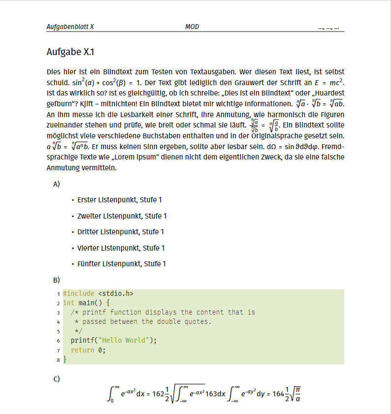
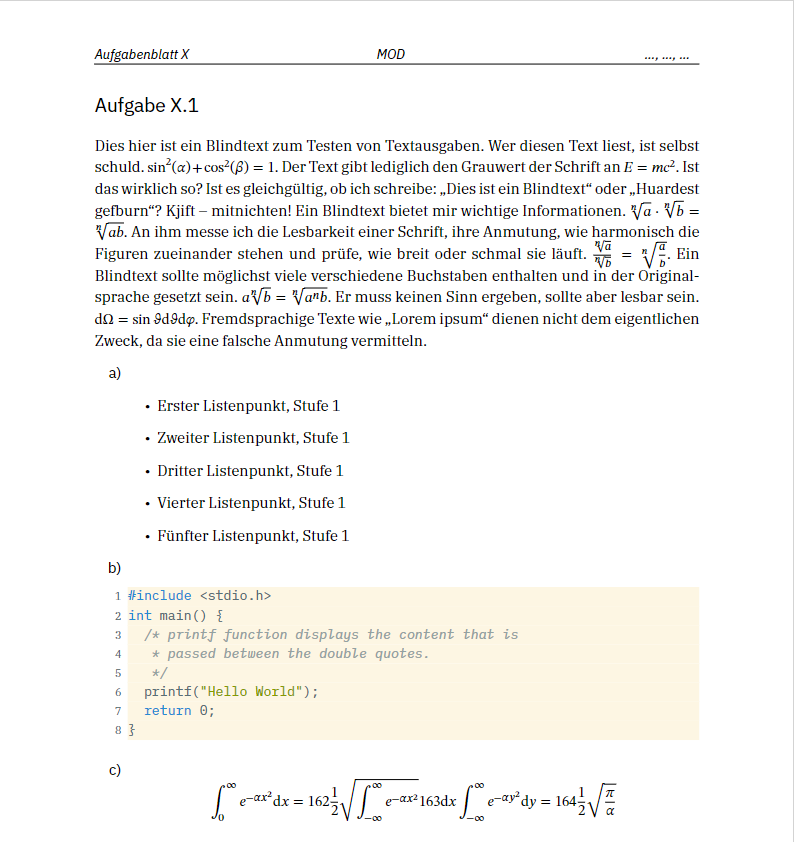
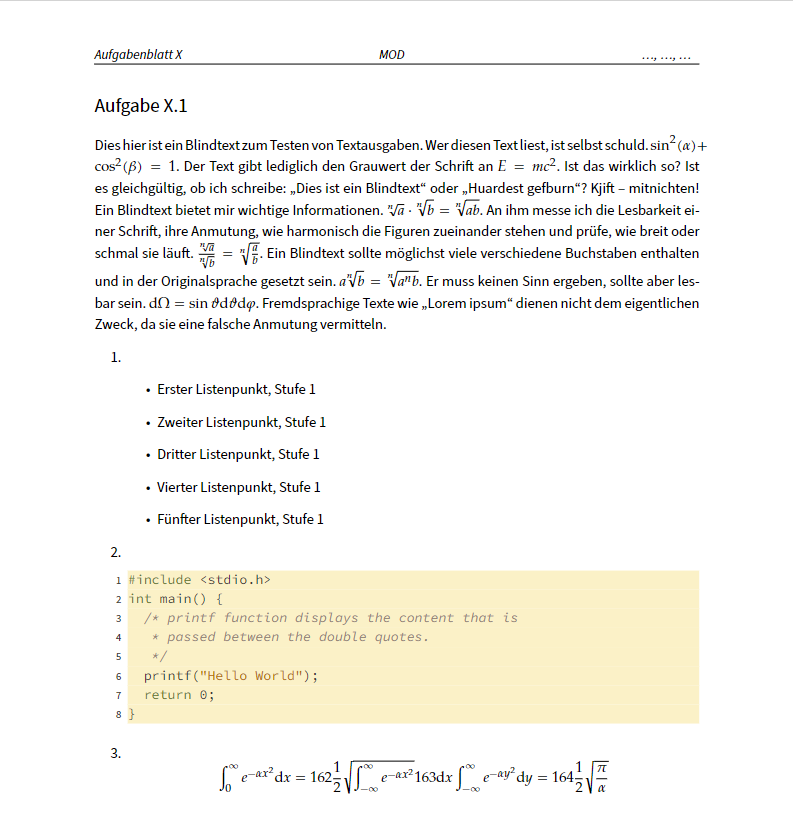
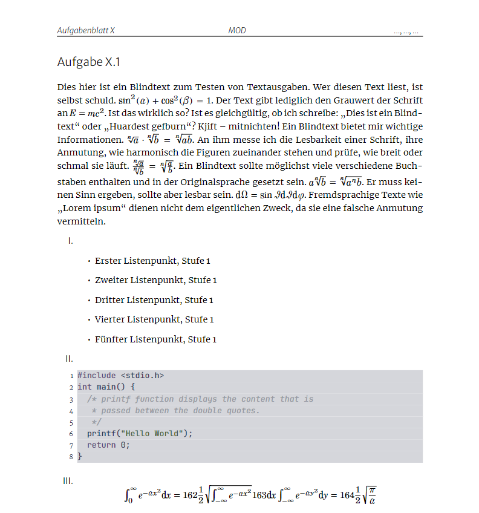
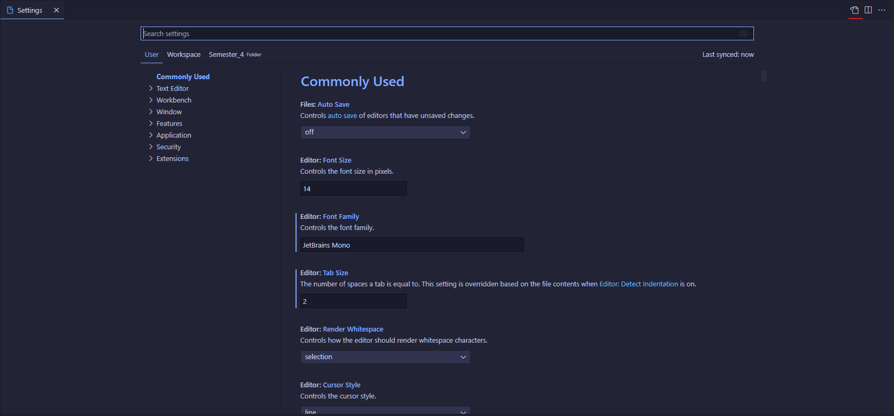
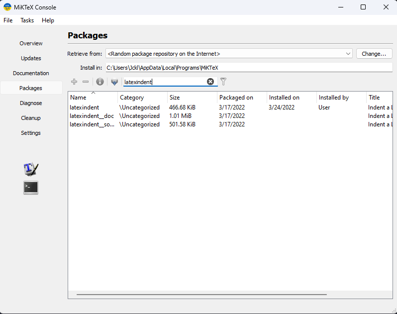
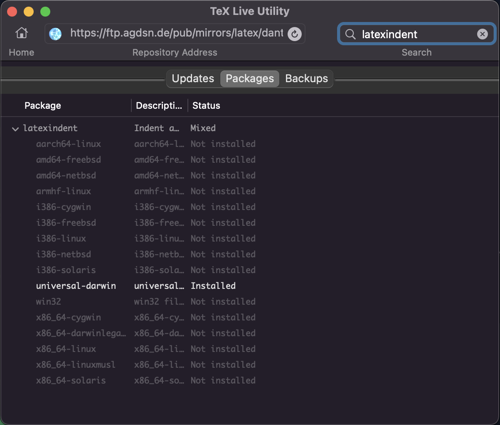
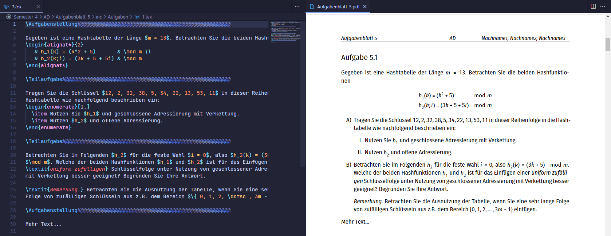

# Hausaufgaben-Template

  Dieses Repository ist ein Vorlage-Layout für die Bearbeitung von Hausaufgaben mithilfe von LaTeX.

## Inhalt

  * [Einführung](##Einführung)
  * [Installation](##Installation)
    * [Generell](###Generell) 
    * [Windows](###Windows) 
    * [macOS](###macOS)
    * [Linux](###Linux)
  * [Nutzung](##Nutzung)

## Einführung

  Im folgenden gibt es eine step-by-step Anleitung, wie man ein beispiel LaTeX Setup aufbauen könnte. Damit man auch Offline arbeiten kann; eine Repository mit "Use this template" erstellen und git als version control benutzen.

  Natürlich kann man die Template auch mit Overleaf benutzen. Dafür einfach die Repository clonen, die .git löschen, das script einmal ausführen, alles in eine zip und dann bei Overleaf hochladen.

  Ein paar beispiel Bilder: 

  
  
  
  

## Einrichten

### Generell

#### Github
  Um changes zu Pullen/Pushen 

  * [GitHub Desktop](https://desktop.github.com/) simple and free
  * oder, [GitKraken](https://www.gitkraken.com/) free Pro version mit [GitHub Student Developer Pack](https://education.github.com/pack#offers) (also free Github Pro)
  * oder, cli [git](https://git-scm.com/)
  * oder, Visual Studio Code

#### Editor

  Man kann jeden Editor benutzen, wichtig ist nur:
  * XeLaTex oder LuaLaTex benutzen
  * Der LaTex compiler muss die flag --shell-escape haben
  * Wenn man latexindent benutzt, dann mit der flag -l=../src/misc/ 

  In diesem Beispiel benutzen wir [Visual Studio Code](https://code.visualstudio.com/). Downloaden und dann [diese Extention](https://marketplace.visualstudio.com/items?itemName=James-Yu.latex-workshop) installieren.

  Zuletzt in die Settings und dann oben rechts, 'Open Settings (JSON)', die json copy-pasten

  


```json
{
    "editor.tabSize": 2,
    "latex-workshop.view.pdf.viewer": "tab",
    "latex-workshop.latex.autoClean.run": "onBuilt",
    "latex-workshop.latex.recipes": [
        {
            "name": "latexmk xelatex",
            "tools": [
                "latexmk"
            ]
        },
        {
            "name": "latexmk lualatex",
            "tools": [
                "latexmk (lualatex)"
            ]
        }
    ],
    "latex-workshop.latex.tools": [
        {
            "name": "latexmk",
            "command": "latexmk",
            "args": [
                "-xelatex",
                "-synctex=1",
                "--shell-escape",
                "-interaction=nonstopmode",
                "-file-line-error",
                "%DOC%"
            ]
        },
        {
            "name": "latexmk (lualatex)",
            "command": "latexmk",
            "args": [
                "-lualatex",
                "-synctex=1",
                "--shell-escape",
                "-interaction=nonstopmode",
                "-file-line-error",
                "%DOC%"
            ]
        }
    ],
    "latex-workshop.latexindent.args": [
        "-c",
        "%DIR%/",
        "%TMPFILE%",
        "-l=../src/misc/"
    ],
    "editor.formatOnSave": true
}
```
  latexindent ist im CTAN, kann also als package installiert werden. Wenn kein latexident benutzt wird, sollten die beiden unteren Optionen weggelassen werden.

#### Inkscape

  [Inkscape](https://inkscape.org/release/inkscape-1.1.2/) muss im [PATH](https://www.studytonight.com/post/how-to-set-path-environment-variable) sein. 

  Windows prob unter: C:\Program Files\Inkscape\bin

  macOS prob unter: /Applications/Inkscape.app/Contents/MacOSn

  Test im Terminal:
  ```
  inkscape --help
  ```
  Bei 'command not found something' ist inkscape nicht im PATH


### Windows

#### Latex

  [MiKTeX](https://miktex.org/download); packages lassen sich ganz einfach über die MiKTeX Console installieren

  
#### Perl

  Windows had kein Perl by default, also einfach downloaden: [Strawberry Perl](https://strawberryperl.com/)

### macOS

#### Latex
  [MacTeX](https://tug.org/mactex/mactex-download.html); packages mit der TeX Live Utility installieren.

  
#### Perl

  Für latexindent fehlen beim System Perl ein paar Modules, die sich nicht installieren lassen. Deshalb einfach [Perlbrew](https://perlbrew.pl/) benutzen und dann mit [cpanm](https://stackoverflow.com/questions/3733482/how-do-i-install-cpan-modules-while-using-perlbrew) die missing Modules installieren.

### Linux

#### Debian/Ubuntu/Mint
```
sudo apt install texlive-full
```
#### Arch
```
sudo pacman -S texlive-most
```
#### Fedora 
```
sudo yum install texlive
```
  sonst kann man [TeX Live](https://www.tug.org/texlive/acquire-netinstall.html) auch upstream installieren. 

  Packages lassen sich mit [*tlmgr*](https://www.tug.org/texlive/tlmgr.html) installieren. Wenn man texlive on Arch mit pacman installiert hat, funktioniert [*tlmgr*](https://www.tug.org/texlive/tlmgr.html) nicht. In diesem Fall [*tllocalmgr*](https://wiki.archlinux.org/title/TeX_Live) benutzen.

```
sudo tlmgr install latexindent
```

## Nutzung

  Im root befindet sich Default.tex. Hier kann man alle wichtigen Einstellungen setzen.

  Das script erstellt einen neuen Ordner mit allen nötigen .tex Dateien. Die Aufgaben und Lösungen sind getrennt voneinander im inc Ordner. Bilder in den img Ordner. 

  Es gibt \Aufgabenstellung und \Teilaufgabe. Beide commands können in beliebiger Reihenfolge auftreten. 

  

  Einfach die Aufgabenstellung copy-pasten, die Lösungen adden und dann auf GitHub pushen.
